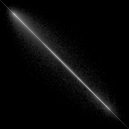
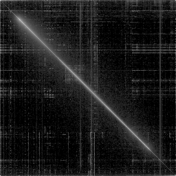

# Reverse Engineer with Data File
## !!! the source code has still troublesome, so autocomplete program like 
```
./nob reverse ./sample/*raw
```
Just produce 5 png and other raw need operation
so you can look up
### ===> Real Source Code: https://github.com/tsoding/musializer.git

### Thanks to tsoding, he taught me many methods about how to use C, if you want to learn advanced C. I think his tutorial is suitable for people who having basic of C, not beginner but you want to try it, you can do it

## CMD
1. Produce some raw file:
   `./nob img2raw ./sample/*png`
2. Produce single binary picture with diagonal:
   `./reverse ./YOUR_PNG_PATH`

## PNG
### Here is some pictures:



GPL LICENSE